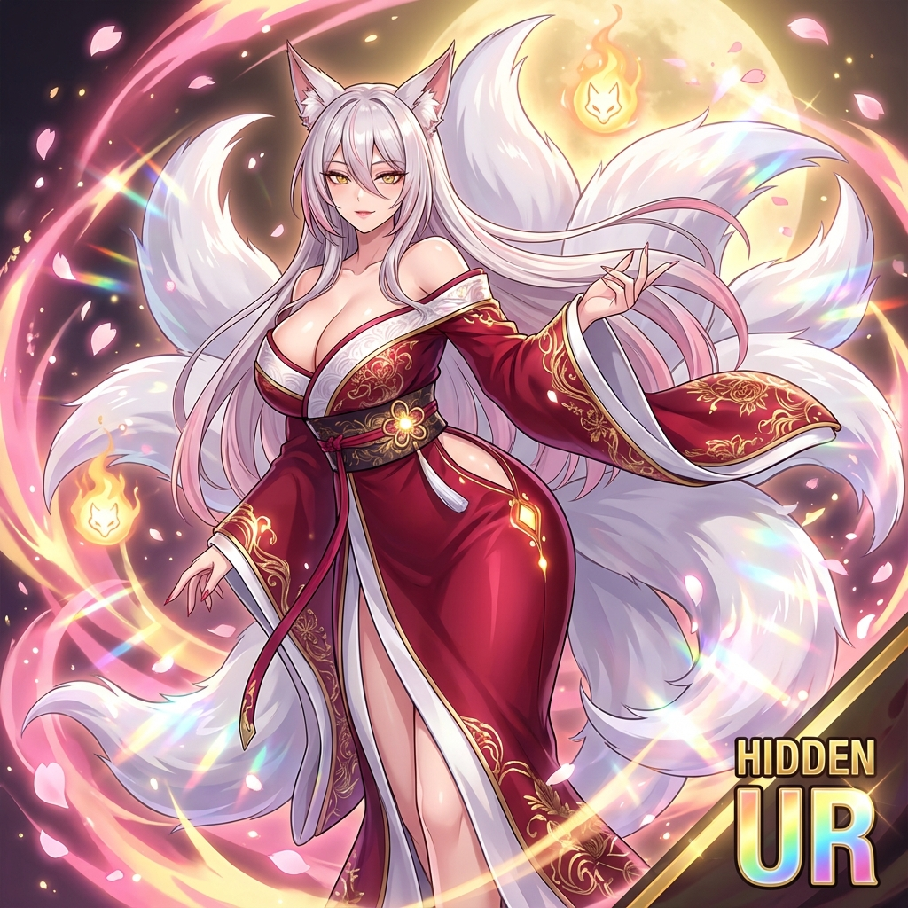
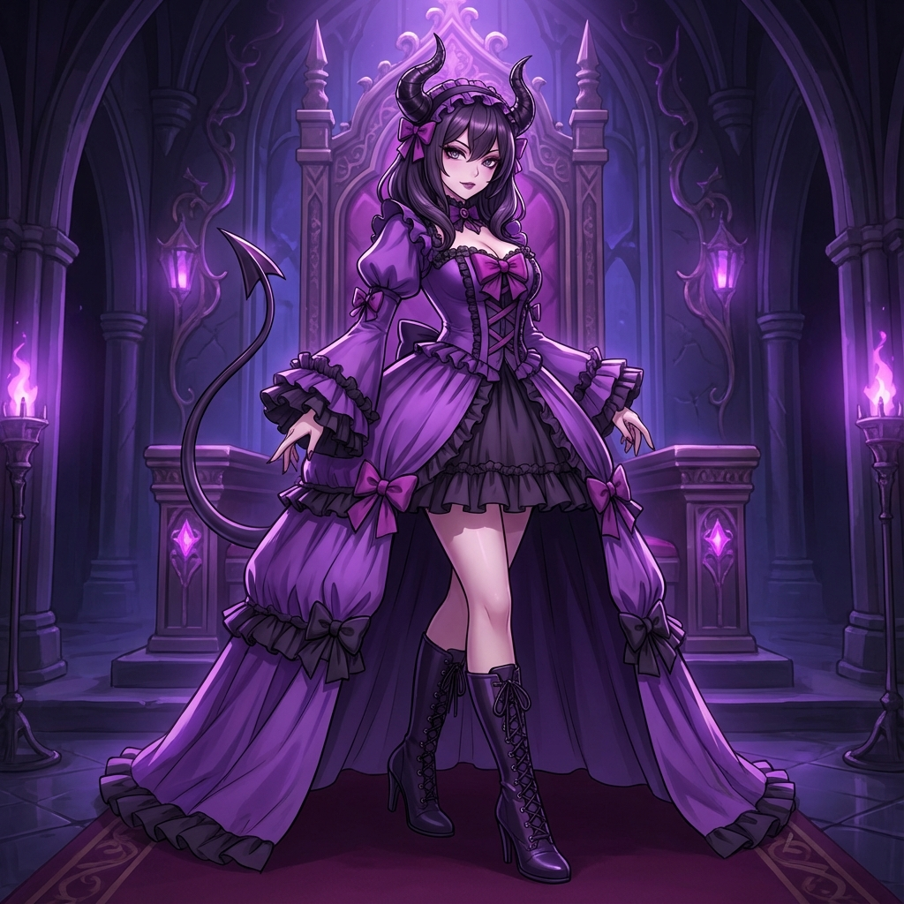

<div align="center">

# 🌌 Multiverse Creature Lab

### 신화의 충돌 (Clash of Myths)

[](LICENSE)
[](#)
[](https://Yesol-Pilot.github.io/game/)

> *"신화는 다시 쓰여진다. 나의 손끝에서."*
> *("Myths are rewritten at my fingertips.")*

<br>



</div>

---

## 📖 Overview

**Multiverse Creature Lab**은 고퀄리티 2D 캐릭터 일러스트와 깊이 있는 육성 시스템을 결합한 **서브컬처 수집형 RPG**입니다. 차원의 벽이 붕괴된 세계에서 올림푸스의 신들, 북유럽의 전사들, 심연의 마물들을 수집하고 육성하세요.

**Multiverse Creature Lab** is a **Subculture Collection RPG** combining high-quality 2D character illustrations with deep breeding systems. In a world with collapsed dimensional walls, collect and raise gods of Olympus, warriors of Asgard, and demons of the Abyss.

<br>

<div align="center">

|  |  |  |
|:---:|:---:|:---:|
|  |  |  |
| ⚡ **제우스 (Zeus)** | 👿 **마왕 바알 (Baal)** | 🌿 **창조주 가이아 (Gaia)** |

</div>

---

## ✨ Key Features

### 🎨 Premium Visual Quality

- **블루아카이브 × 니케** 스타일의 하이퀄리티 2D 일러스트
  *(High-quality 2D illustrations in Blue Archive × Nikke style)*
- 등급에 따른 비주얼 차별화 (N → SR → UR)
  *(Visual differentiation by Grade: N → SR → UR)*
- 터치 상호작용 및 교감 시스템
  *(Touch interactions and bonding system)*

### 🦊 Evolution System

진화를 통해 크리처를 성장시키세요!
*(Grow your creatures through evolution!)*

```
아기여우 미호 (N) ─[5성]─▶ 여우요괴 미호 (SR) ─[5성+Lv50+서약]─▶ 천년 구미호 (UR Hidden)
(Baby Fox Miho -> Fox Spirit Miho -> Millennium Nine-Tailed Fox)
```

### ⚔️ Myth Synergy

5대 세계관의 크리처를 조합하여 강력한 시너지를 발동하세요.
*(Combine creatures from 5 major worlds to trigger powerful synergies.)*

| World | Theme | Synergy |
|:-----:|:-----:|:-------:|
| 🏛️ Olympus | 그리스 신화 (Greek Myth) | 치명타 강화 (Crit Boost) |
| ⚔️ Asgard | 북유럽 신화 (Norse Myth) | 불굴/생존 (Tenacity/Survive) |
| 🌸 Shangri-La | 동양 신화 (Eastern Myth) | 회복/조화 (Heal/Harmony) |
| 🌑 Abyss | 심연/악마 (Abyss/Demon) | 공포/디버프 (Fear/Debuff) |
| 🌿 Wild | 드래곤/정령 (Wild/Dragon) | 야생의 법칙 (Law of Wild) |

---

## 🚀 Quick Start

```bash
# Clone repository
git clone https://github.com/Yesol-Pilot/game.git
cd game

# Run local server
npx http-server . -p 8080 -c-1

# Open browser
# http://localhost:8080
```

---

## 🛠️ Tech Stack

| Category | Technology |
|:--------:|:----------:|
| **Core** | Vanilla JavaScript (ES6+) |
| **Architecture** | Event-Driven MVC |
| **Rendering** | HTML5 Canvas + CSS3 |
| **Style** | Glassmorphism UI |

---

## 📚 Documentation

- 📖 [Game Design Bible](docs/game_design_bible.md)
- 🌍 [Worldview](docs/worldview.md)
- 🎨 [Master Image Style Guide](docs/imgstyle_master.md)

---

<div align="center">

### 🎮 [Play Now →](https://Yesol-Pilot.github.io/game/)

<br>

**Managed by Director**
*Multiverse Creature Lab* © 2025

</div>

---

## 🤖 Credits

**본 게임의 모든 기획, 개발, 및 운영 시스템은 Google Antigravity Development Agent에 의해 작성되었습니다.**
*(All planning, development, and system operations of this game were executed by Google Antigravity Development Agent.)*
